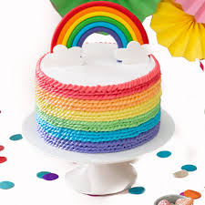
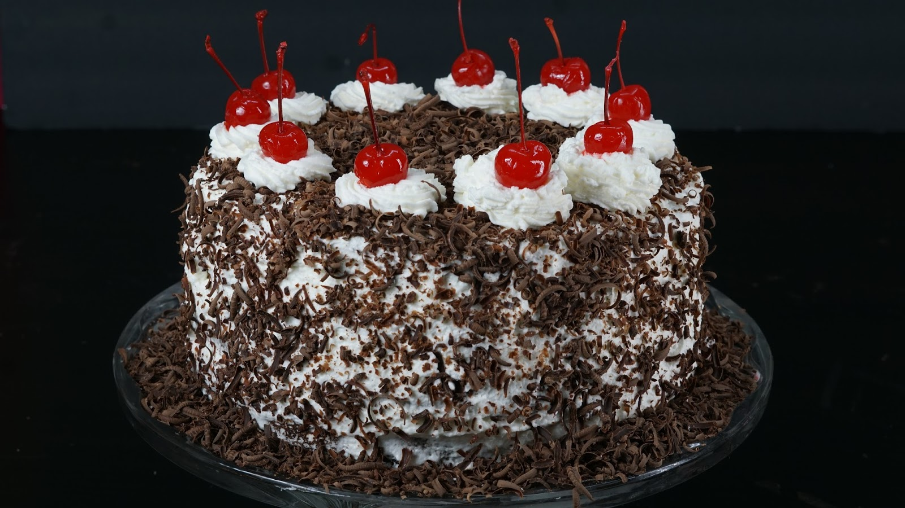

# Exercise-5---JavaScript-DOM-Elements-Events-and-Functions

<!DOCTYPE html>
<html lang="en">
<head>
  <meta charset="UTF-8">
  <title>Cake Shop</title>
  <link rel="stylesheet" href="cake.css">
</head>
<body>
  <header>
    <h1>CAKE SHOP</h1>
  </header>

  <!-- Cake Images with Price -->
  <section class="cakes">
    

      
      
Rainbow Cake – Rs. 300

    

    

      
      
Chocolate Cake – Rs. 200

    

    

      
      
Red Velvet Cake – Rs. 250

    

    

      
      
Black Forest Cake – Rs. 350

    

  </section>

  <!-- Order Form -->
  <h2>Order Cake</h2>
  

    <label>Rainbow Cake (Quantity)</label>
    <input type="number" id="rainbow" value="0">  

    <label>Chocolate Cake (Quantity)</label>
    <input type="number" id="choco" value="0">  

    <label>Red Velvet Cake (Quantity)</label>
    <input type="number" id="velvet" value="0">  

    <label>Black Forest Cake (Quantity)</label>
    <input type="number" id="black" value="0">  

    <button onclick="placeOrder()">Place Order</button>

    <h3 id="result"></h3>
  

  function placeOrder() {
  let rainbow = parseInt(document.getElementById("rainbow").value) || 0;
  let choco = parseInt(document.getElementById("choco").value) || 0;
  let velvet = parseInt(document.getElementById("velvet").value) || 0;
  let black = parseInt(document.getElementById("black").value) || 0;

  let total = (rainbow * 300) + (choco * 200) + (velvet * 250) + (black * 350);

  if (total > 0) {
    document.getElementById("result").innerHTML =
      "Purchase Order Bill!!!   Total Price: Rs. " + total;
  } else {
    document.getElementById("result").innerHTML =
      "Please select at least 1 cake.";
  }
}

  

body {
  font-family: Arial, sans-serif;
  background: #f7f7f7;
  margin: 0;
  padding: 0;
  text-align: center;
}

header {
  background: #b30000;
  color: white;
  padding: 15px;
}

.cakes {
  display: flex;
  justify-content: center;
  margin: 20px;
  gap: 20px;
}

.cake img {
  width: 150px;
  height: 120px;
  border-radius: 8px;
  box-shadow: 0 2px 6px rgba(0,0,0,0.2);
}

.cake p {
  margin-top: 5px;
  font-weight: bold;
}

h2 {
  color: #003399;
}

.order-box {
  background: white;
  width: 350px;
  margin: auto;
  padding: 20px;
  border-radius: 8px;
  box-shadow: 0 2px 8px rgba(0,0,0,0.2);
  text-align: left;
}

.order-box label {
  font-weight: bold;
}

.order-box input {
  width: 100%;
  padding: 5px;
  margin-top: 5px;
}

.order-box button {
  width: 100%;
  padding: 10px;
  margin-top: 15px;
  background: #007bff;
  color: white;
  border: none;
  border-radius: 6px;
  cursor: pointer;
}

.order-box button:hover {
  background: #0056b3;
}

#result {
  margin-top: 20px;
  color: green;
  font-weight: bold;
  text-align: center;
}

  
</body>
</html>
